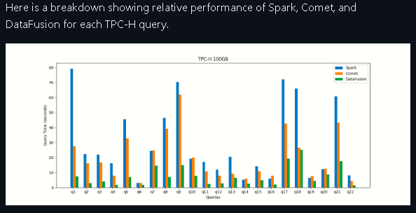
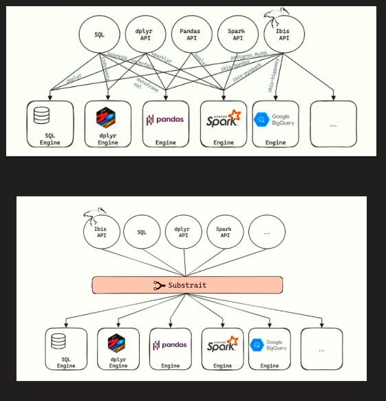
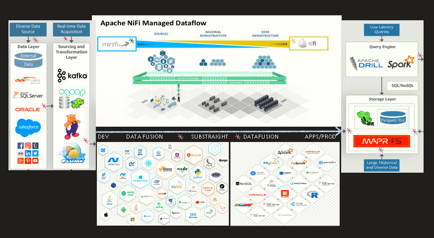
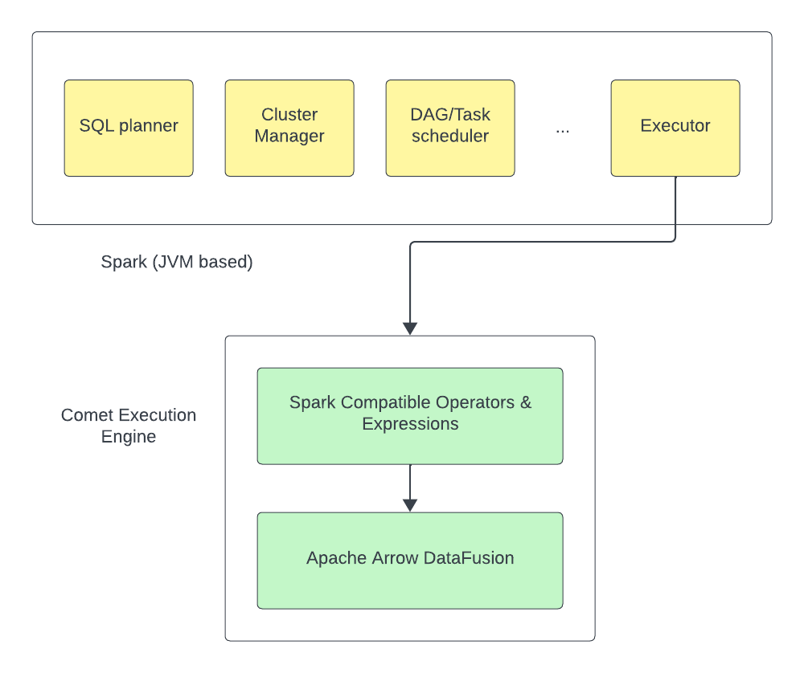
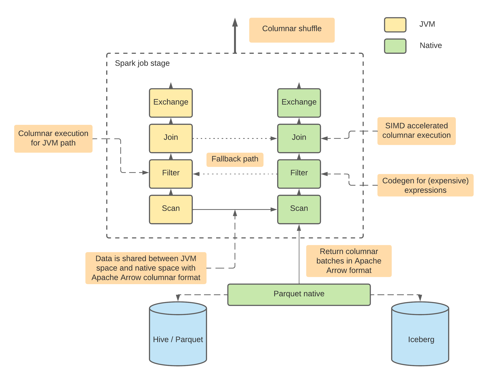

<!--
Licensed to the Apache Software Foundation (ASF) under one
or more contributor license agreements.  See the NOTICE file
distributed with this work for additional information
regarding copyright ownership.  The ASF licenses this file
to you under the Apache License, Version 2.0 (the
"License"); you may not use this file except in compliance
with the License.  You may obtain a copy of the License at

  http://www.apache.org/licenses/LICENSE-2.0

Unless required by applicable law or agreed to in writing,
software distributed under the License is distributed on an
"AS IS" BASIS, WITHOUT WARRANTIES OR CONDITIONS OF ANY
KIND, either express or implied.  See the License for the
specific language governing permissions and limitations
under the License.
-->
# Expert E2E Unified Data Science & Analytics Architecture

Modern organizations need a modular data architecture that supports complex enterprise environments while delivering data access to business users. 

# Apache DataFusion Comet

This is a non-affiliated build out on windows subsystem for Lynx (WSL2) FOR the Apache DataFusion plugin ==> Spark/Hadoop. Apache DataFusion is a very fast, extensible query engine for building high-quality data-centric systems in Rust, using the Apache Arrow in-memory format. Python Bindings are also available. DataFusion offers SQL and Dataframe APIs, excellent performance, built-in support for CSV, Parquet, JSON, Avro, & more.

# Apache Spark

Apache Spark™ is a multi-language engine for executing data engineering, data science, and machine learning on single-node machines or clusters & might be one of the most widely-used engine for scalable computing

Comet is designed to significantly enhance the performance of Apache Spark workloads while leveraging commodity hardware and seamlessly integrating with the Spark ecosystem without requiring any code changes.

Reference the "Spark_3.51_plus_datafusion-comet_Build_wsl2" file for for the a-z process including rust dependencies & python bindings.

See below for links to the official site & description nomenclature. The following are important features:

# Targeted Capabilities

>>  This build on wsl2, allows for dual windows/lynx support. Compiled on Server 2022 with Ubuntu-22.04 WSL Version 2. Attain significant performance increases leveraging only commodity hardware.

>> Data Fusion supports Substrait, i.e ===> unified  compute operations on structured data, for interoperability across different languages and systems.

>> Comet doesn't have official release yet so currently the only way to test it is to build jar and include it in your Spark application.

>> Implement Zero-cost abstractions, Pattern matching, Type inference, No garbage collection, & Native Concurrency through Rust



Performance-critical backend systems are software components or services that handle tasks that require high-speed processing, low-latency responses, and efficient resource utilization. Rust’s performance, thread safety, and error handling make it an excellent choice for developing these types of systems.

TensorFlow and PyTorch currently dominate the deep learning landscape. At the Enterprise level, advanced  development often requires to extend these libraries or interface them with other systems. Deep learning models & AI are just one component of a larger system

>>>  Implement in tandem with custom extensions for PG/Citus/etc in-DB solutions or Package custom libraries in R, Python or Java.

>>>  Wpgu - GPU Compute in the Browser at the Speed of Native: WebGPU Marching Cubes.

>>>  FFI (C  Application Binary Interface (ABI ABI)), C compatible interface with a wide range of  libraries and languages, including C++

>>>  Effortless JS Integration, code is entirely sandboxed from the host, having no filesystem or network access. Asynchronous JS code support

>>>  PowerShelL Rust FFI access API through .NET framework to Win32 or Azure, technique called P/Invoke (Platform Invocation Services)




>>> Implement on Kubernetes as part of modular open source data platform. Deploy simple to complex environments with infrastructure-as-code. Management through an Operator framework using Rust libraries & supporting the fast and unified development of Kubernetes controllers and operators. See Associated Repo's.


------------------------------------------------------------------------------------------------------------------------------------------------


Apache DataFusion Comet is an Apache Spark plugin that uses [Apache DataFusion](https://datafusion.apache.org/)
as native runtime to achieve improvement in terms of query efficiency and query runtime.

Comet runs Spark SQL queries using the native DataFusion runtime, which is
typically faster and more resource efficient than JVM based runtimes.

<a href="doc/comet-overview.png"></a>


## Architecture

The following diagram illustrates the architecture of Comet:

<a href="doc/comet-overview.png"></a>

## Current Status

The project is currently integrated into Apache Spark 3.2, 3.3, and 3.4.

## Supported Platforms

Linux, Apple OSX (Intel and M1)

------------------------------------------------------------------------------------------------------------------------------------------------------------------
*** This build on wsl2, allows for dual windows/lynx support. Compiled on Server 2022 with Ubuntu-22.04 WSL Version 2 ***
------------------------------------------------------------------------------------------------------------------------------------------------------------------
## Requirements

- Apache Spark 3.2, 3.3, 3.4, 3.5
- JDK 8 and up
- GLIBC 2.17 (Centos 7) and up

## Getting started

Make sure the requirements above are met and software installed on your machine

### Clone the official repo

```commandline
git clone https://github.com/apache/datafusion-comet.git
```


### Run Spark with Comet enabled

Make sure `SPARK_HOME` points to the same Spark version as Comet has built for.

```
$SPARK_HOME/bin/spark-shell --jars spark/target/comet-spark-spark3.4_2.12-0.1.0-SNAPSHOT.jar \
--conf spark.sql.extensions=org.apache.comet.CometSparkSessionExtensions \
--conf spark.comet.enabled=true \
--conf spark.comet.exec.enabled=true \
--conf spark.comet.exec.all.enabled=true
```

### Verify Comet enabled for Spark SQL query

Create a test Parquet source

```scala
scala> (0 until 10).toDF("a").write.mode("overwrite").parquet("/tmp/test")
```

Query the data from the test source and check:

- INFO message shows the native Comet library has been initialized.
- The query plan reflects Comet operators being used for this query instead of Spark ones

```scala
scala> spark.read.parquet("/tmp/test").createOrReplaceTempView("t1")
scala> spark.sql("select * from t1 where a > 5").explain
INFO src/lib.rs: Comet native library initialized
== Physical Plan ==
        *(1) ColumnarToRow
        +- CometFilter [a#14], (isnotnull(a#14) AND (a#14 > 5))
          +- CometScan parquet [a#14] Batched: true, DataFilters: [isnotnull(a#14), (a#14 > 5)],
             Format: CometParquet, Location: InMemoryFileIndex(1 paths)[file:/tmp/test], PartitionFilters: [],
             PushedFilters: [IsNotNull(a), GreaterThan(a,5)], ReadSchema: struct<a:int>
```

### Enable Comet shuffle

Comet shuffle feature is disabled by default. To enable it, please add related configs:

```
--conf spark.shuffle.manager=org.apache.spark.sql.comet.execution.shuffle.CometShuffleManager
--conf spark.comet.exec.shuffle.enabled=true
```

Above configs enable Comet native shuffle which only supports hash partition and single partition.
Comet native shuffle doesn't support complex types yet.

Comet doesn't have official release yet so currently the only way to test it is to build jar and include it in your Spark application. Depending on your deployment mode you may also need to set the driver & executor class path(s) to explicitly contain Comet otherwise Spark may use a different class-loader for the Comet components than its internal components which will then fail at runtime. For example:

```
--driver-class-path spark/target/comet-spark-spark3.4_2.12-0.1.0-SNAPSHOT.jar
```

Some cluster managers may require additional configuration, see https://spark.apache.org/docs/latest/cluster-overview.html